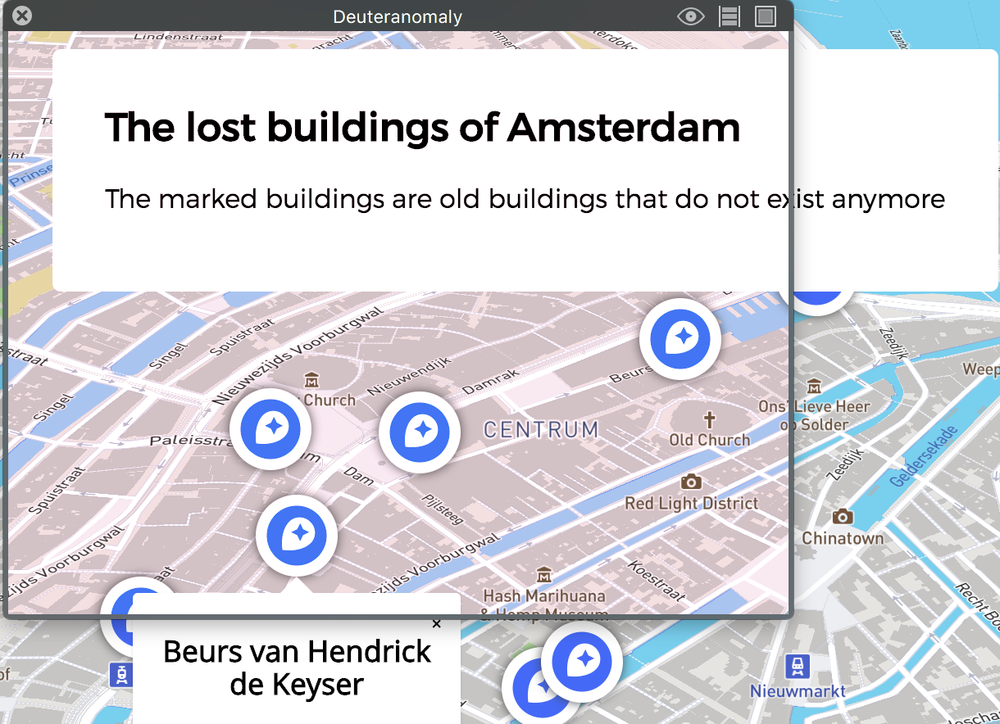

# Oba/Browser-technologies
In this document I will apply some browser-technologies cases
towards my code.  

:fire:[LINK](https://sam-guliker.github.io/oba/):fire: to the project.

[](https://gyazo.com/827df2002f9a1fcd478e2115be8c1c3f)  

## Progressive Enhancement
With this list I will try to make my code more accessible  
and useful for every user. I made a list to try and  
tackle this subject. But what __IS__ Progressive Enhancement? :thinking:

Progressive Enhancement is a layered approach for building websites.  
HTML is for the content, css is for the style and javascript  
is for the interactivity. If the javascript breaks, the site should still work  
and look good. If the css doesn't load for some reason  
the html should still be able to use the hyperlinks for functionallity.

## Tools
These are the tools I will be using to test my website for optimalization and accessibility.  

* [developers.google.com](https://developers.google.com/speed/docs/insights/about?hl=en-US&utm_source=PSI&utm_medium=incoming-link&utm_campaign=PSI) will tests on speed and optimalization.  

* [Sim Daltonism](https://itunes.apple.com/us/app/sim-daltonism/id693112260?mt=12) with this tool you can test on different colours.  
This way you can test if your website is still working for people that are colourblind.

* [Webpagetest](https://www.webpagetest.org/) Getting some general data from the webpage.

### The list:
* Cross-browser
* Images
* Custom fonts
* Javascript
* Colours
* Broad band
* Cookies
* localStorage
* Mouse/trackpad

## Cross-Browser
Testing on different browsers to check if my code still works.  
Works on chrome and safari. Firefox isn't working I need to debug it.

## Images
Images make up to 64% of the average webpage. Image sizes have been  
growing in the couple of last years. The average image size at this  
point of time is 2219kb. Four years ago this was 991kb

I'm not using any images for this webpage.    
But the stuff I can do for it is for example bringing  alt tags towards the code and maybe some aria labels if  I want to give some extra information.  


### Alt tag
An ALTernative text describing the image.

```HTML
  
```

### Aria Labels
Accessible Rich Internet Applications (ARIA) can be used to help people with disabilities.


```HTML
  <button aria-label="Close" type="button" name="button">x</button>
```

## Fonts
Fonts are a difficult part of the web. Every system renders a font different.  
This is also the same with browsers. Therefor we should reconsider what  
fonts to use. There are a couple of _"safe fonts"_.

I'm using the google web-fonts that are from another CDN.  
This means when the CDN server is down it will load the fallback fonts.  


### Alternative
You can load the fonts in from your own webpage.  

## Javascript
Trying my website without Javascript...  
Well this wont work :pensive:  The API loads in my data
and Javascript generates the map.

## Colours
Different colourblind tests using Sin Daltonism  

### Deuteroanopia  
> Deuteranopia (also called green-blind). In this case the medium wavelength sensitive cones (green) are missing at all.

Source: [color-blindness](http://www.color-blindness.com/deuteranopia-red-green-color-blindness/)

  

### Deuteranomaly  
> Normal blue and some red cones are normal plus some anomalous red-like
  cones (5 percent of Caucasian males)

Source: [disorders.eyes.arizona](http://disorders.eyes.arizona.edu/category/alternate-names/deuteranomaly)


  

### Protanopia  
>Red-green color blindness is split into two different types: Whereas people affected by protan color blindness are less sensitive to red light, deuteranopia or deuteranomly (the second type of red-green color blindness) is related to sensitiveness on green light.

Source: [color-blindness](http://www.color-blindness.com/protanopia-red-green-color-blindness/)

  

### Protanomaly  
>If the L-cones are defective they appear in different intensities. This results in either a stronger or a weaker color blindness. If L-cones are not missing but defective it is called protanomaly. People suffering from this kind of color blindness are called anomalous trichromats.

Source: [color-blindness](http://www.color-blindness.com/protanopia-red-green-color-blindness/)

  

### Tritanopia  
> Actually the wording blue-yellow color blindness is misleading. People affected by tritan color blindness confuse blue with green and yellow with violet. So the term blue-green color blindness would be more accurate because the colors blue and yellow are usually not mixed up by tritanopes.

Source: [color-blindness](http://www.color-blindness.com/tritanopia-blue-yellow-color-blindness/)

  

### Tritanomaly
>This is an alleviated form of blue-yellow color blindness, where the S-cones are present but do have some kind of mutation.


Source: [color-blindness](http://www.color-blindness.com/tritanopia-blue-yellow-color-blindness/)

  

## Broadband Internet
On fast 3g the map is rendered after 1s.  

  

On slow 3G the map is rendered on 4s.

  

## Cookies
I'm not using HTTP :cookie: just make sure you keep the size  
of the cookies as low as possible to minimize the impact  on the user's response time.

## LocalStorage
Unfortunately I wasn't able to find anything to help me test this.

## Mouse/Trackpad
  

My webpage is not really accessible for tabbing at the moment.   
Maybe I can make it more tab-able so the user can tab  through all the items on the map.


## Testing with the tools
Web chrome dev tools, but also different test sources.
* [Webpagetest](https://www.webpagetest.org/result/180318_TM_720ad9ed8222f15dd4ce3f79fefb07a0/)
* [developers.google.com](https://developers.google.com/speed/docs/insights/about?hl=en-US&utm_source=PSI&utm_medium=incoming-link&utm_campaign=PSI)

### For mobile


### for Desktop


## Using Webpagetest
The images have a big impact on my website, I should  
look what I can do with the API and getting the images in to optimize it.


## Device lab

## Sources:
### Progressive enhancement
* [Treehouse](http://blog.teamtreehouse.com/progressive-enhancement-past-present-future)
* [Molily](https://molily.de/javascript-failure/)

### Colour-blindness
* [Color-blindness](http://www.color-blindness.com/protanopia-red-green-color-blindness/)

### Images
* [MDN](https://developer.mozilla.org/en-US/docs/Web/HTML/Attributes)
* [Soasta](https://www.soasta.com/blog/page-bloat-2015-web-performance-monitoring/)

### fonts
* [Artequelswork](http://artequalswork.com/posts/better-css-font-stacks/)
* [24ways](https://24ways.org/2015/designing-with-contrast/)

### Broadband
* [Developers.google](https://developers.google.com/web/tools/chrome-devtools/network-performance/network-conditions)
* [Webpagetest](https://www.webpagetest.org/result/180318_TM_720ad9ed8222f15dd4ce3f79fefb07a0/)

### License
Copyright © 2018 Sam Guliker. Released under the [MIT license](https://opensource.org/licenses/MIT)
